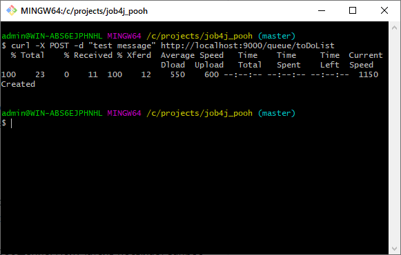
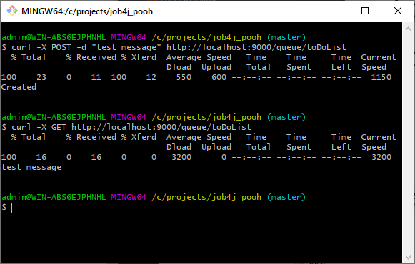
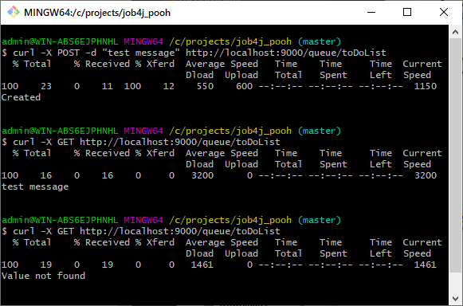
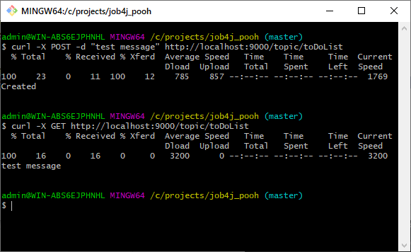
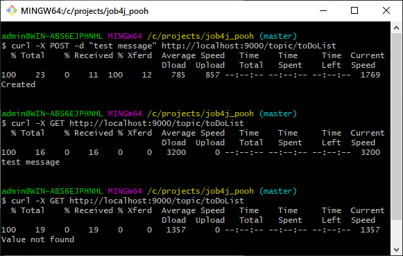

[](https://app.travis-ci.com/VadimShein/job4j_pooh)

# <p align="center">Проект асинхронная очередь</p>

## Используемые технологии:
* Java 13
* Concurrency, Sockets
* JUnit

## Описание:
Приложение реализует функционал асинхронной очереди в двух режимах topic и queue.
Приложение работает по HTTP протоколу и ожидает клиентов (отправителей и получателей сообщений) через запущенный Socket на порту 9000.
Сообщения добавляются в именованую очередь. Сообщения могут доставляться всем получателям (режим topic) или только первому получившему (режим queue).

## Режим Queue
Отправитель посылает Post запрос с указанием режима работы, названием очереди и текста сообщения.
Сообщение добавляется в конец указанной очереди, если очередь отсутствует, то создается новая. 
Получатель посылает Get запрос с указанием режима работы и названием очереди.
Сообщение забирается из начала очереди и удаляется. 
Если к очереди обращаются несколько получателей, то они поочередно получают сообщения. 
Каждое сообщение в очереди может быть получено только одним получателем.

1. Добавление сообщения "test message" в очередь toDoList
```
curl -X POST -d "test message" http://localhost:9000/queue/toDoList
```



2. Получение сообщения из очереди через Get запрос
```
curl -X GET http://localhost:9000/queue/toDoList
```



3. Если данных больше нет, приложение уведомляет  об этом.



## Режим Topic
Отправитель также посылает Post запрос с указанием режима работы, названием очереди и текста сообщения.
Сообщение добавляется в конец указанной очереди, если очередь отсутствует, то создается новая. 
При первом обращении для каждого получателя создается своя индивидуальная очередь, из которой получатели получают абсолютно все сообщения. 


1. Добавление сообщения "test message" в очередь toDoList
```
curl -X POST -d "test message" http://localhost:9000/topic/toDoList
```


2. Получение сообщения из очереди через Get запрос
```
curl -X GET http://localhost:9000/topic/toDoList
```



3. Если данных больше нет, приложение уведомляет об этом




## Запуск проекта:
1. Скопировать проект 
```
git clone https://github.com/VadimShein/job4j_pooh
```

2. Выполнить сборку проекта 
```
mvn clean package -DskipTests
```

3. Запустить проект
```
java -jar target/job4j_pooh-1.0.jar
```


## Контакты:
[](https://t.me/SheinVadim)
[](mailto:shein.v94@mail.ru)
